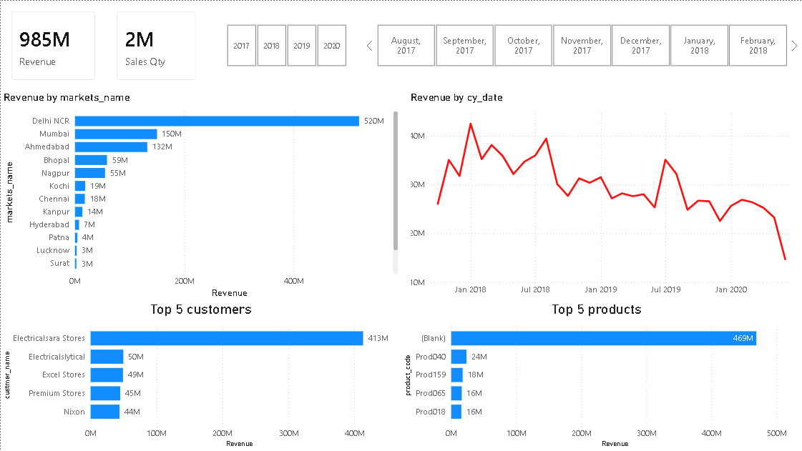
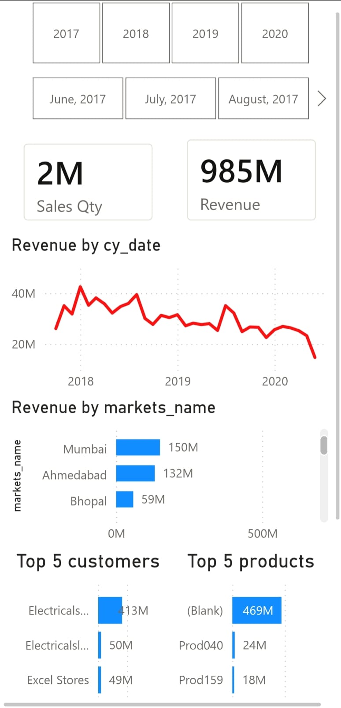

# Sales Insights Dashboard (Power BI)

## 📌 Project Overview
This project focuses on analyzing sales data to extract meaningful business insights using Power BI and SQL. The objective is to identify revenue trends, top-performing markets, and customer behavior to support data-driven decision making.

---

## 📊 Key Insights
- Identified top-performing markets contributing the highest revenue
- Analyzed monthly sales trends to detect seasonality patterns
- Highlighted high-value customers and their contribution to overall sales
- Observed product demand patterns to understand business performance

---

## 🛠️ Tools & Technologies
- Power BI
- SQL
- Data Cleaning & Transformation

---

## 📷 Dashboard Preview

### 🔹 Desktop Dashboard View

### 🔹 Mobile Dashboard View

---

## 📁 Dataset
The dataset is provided as an SQL file containing sales transactions, customer details, and product information used for analysis.

---

## 🚀 Features
- Interactive dashboard with filtering capabilities
- KPI tracking for revenue and performance
- Visual representation of trends and business insights
- Clean and intuitive dashboard design

---

## 📌 Outcome
Developed an interactive dashboard to analyze sales performance, identify key revenue drivers, and support data-driven decision-making.
- Improved understanding of business performance by analyzing key revenue drivers and customer segments

---

## 🔗 Repository Contents
- Power BI Dashboard file (.pbix)
- SQL dataset file
- Dashboard screenshots
